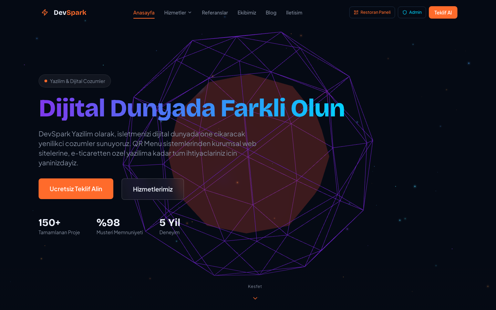
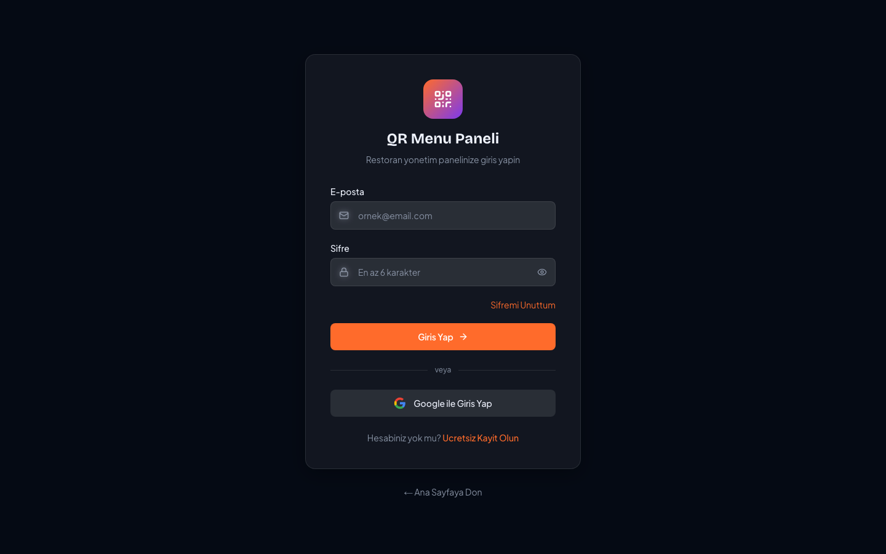
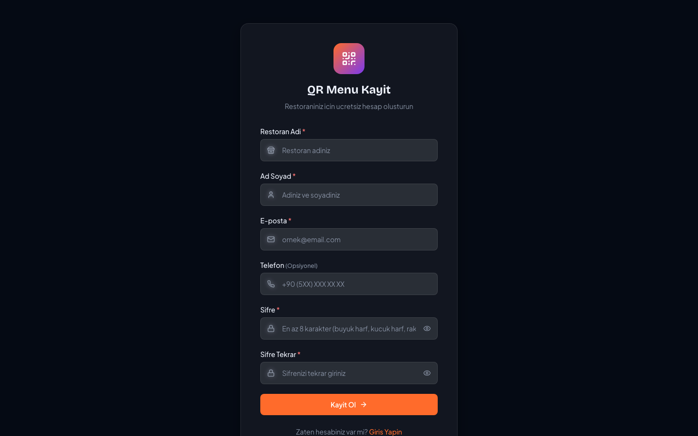
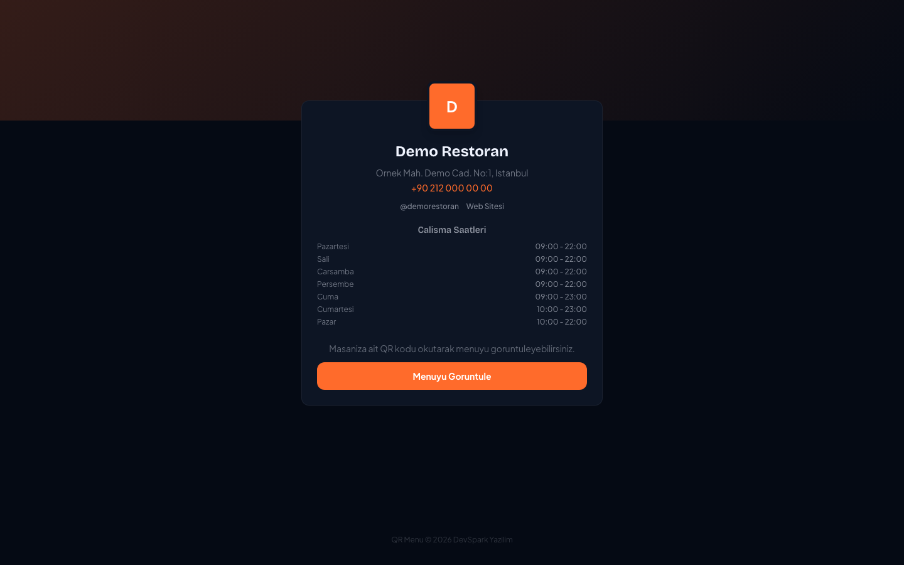
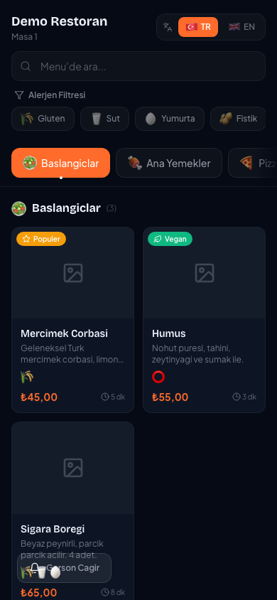
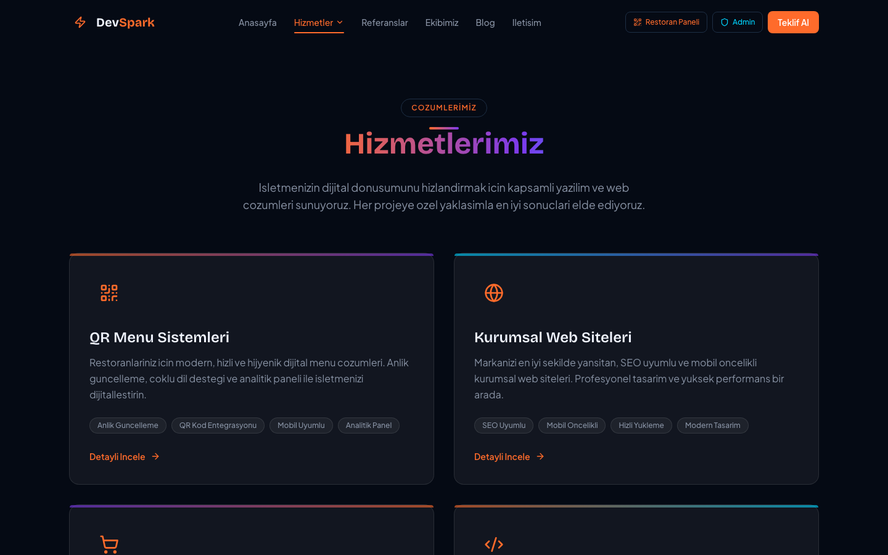
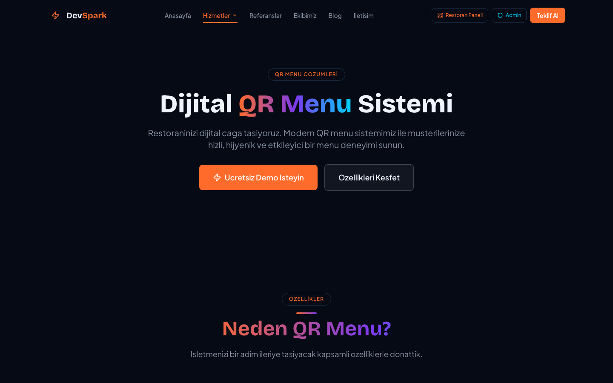

<p align="center">
  
  
  
  
  
</p>

# QR Menu SaaS Platform

Restoran ve kafeler icin enterprise-ready QR menu yonetim sistemi. Musterileriniz QR kodu okutarak dijital menuye ulasir, siparis verir ve garson cagirabilir. Siz ise guclu dashboard uzerinden her seyi yonetirsiniz.

---

## Ekran Goruntuleri

### Ana Sayfa
<p align="center">
  
</p>

### QR Menu Giris & Kayit
<p align="center">
  
  
</p>

### Restoran Landing & Dijital Menu (Mobil)
<p align="center">
  
  
</p>

### Hizmetler & QR Menu Cozumleri
<p align="center">
  
  
</p>

---

## Ozellikler

### Musteri Tarafi (Public QR Menu)
- QR kod ile dijital menu erisimi
- Kategorilere gore filtreleme ve arama
- Alerjen filtreleme (gluten, sut, findik vb.)
- Sepete urun ekleme ve modifier (ekstra malzeme) secimi
- Siparis verme (server-side fiyat dogrulamali)
- Garson cagirma butonu
- Coklu dil destegi (TR/EN)
- Mobil uyumlu tasarim
- Sepet kaliciligi (sayfa yenilense bile korunur)

### Restoran Yonetim Paneli (Dashboard)
- **Ana Sayfa:** Gunluk KPI'lar, haftalik gelir grafigi, en cok satanlar, son siparisler
- **Menu Yonetimi:** Kategori ve urun CRUD, drag-drop siralama, CSV import/export, toplu fiyat guncelleme
- **Masa Yonetimi:** Gorsel masa haritasi, drag-drop pozisyonlama, QR kod olusturma ve toplu indirme
- **Siparis Takibi:** Kanban board, KDS (mutfak goruntuleme), realtime siparis bildirimleri
- **Kampanyalar:** Kupon, combo menu, happy hour, banner duyuru olusturma
- **Analitik:** Gelir trendleri, urun satis analizi, masa doluluk oranlari
- **Tema Editoru:** Canli onizleme ile renk, font, layout ozellestirme
- **Personel Yonetimi:** Garson, asci, kasiyer, yonetici rolleri ve yetkilendirme
- **Rezervasyonlar:** Tarih bazli rezervasyon takibi, durum yonetimi
- **Stok Yonetimi:** Urun takibi, dusuk stok uyarilari, hizli stok guncelleme
- **Ayarlar:** Restoran bilgileri, calisma saatleri, bildirim tercihleri, plan yonetimi

### Super Admin Paneli
- Platform geneli istatistikler
- Restoran yonetimi (askiya alma, silme, taklit etme)
- Kullanici yonetimi ve rol atama
- Plan ve ozellik limitleri yonetimi
- Duyuru sistemi
- Sistem durumu izleme

### Guvenlik
- Server-side fiyat dogrulama (client manipulasyonu engellenir)
- CSRF korumasi (tum API endpointlerinde)
- Rate limiting (IP bazli)
- Row Level Security (Supabase RLS)
- Middleware ile rol tabanli erisim kontrolu
- Security headers (X-Frame-Options, CSP, Referrer-Policy)
- Guclu parola politikasi (min 8 karakter, buyuk/kucuk harf, rakam)
- Storage dosya izolasyonu (owner bazli klasor erisimleri)

---

## Teknoloji Yigini

| Katman | Teknoloji |
|--------|-----------|
| Frontend | Next.js 14 (App Router), React 18, TypeScript |
| Styling | Tailwind CSS, Radix UI, Framer Motion |
| Backend | Supabase (Auth, PostgreSQL, Realtime, Storage) |
| State | Zustand (persist middleware ile localStorage) |
| Validation | Zod (tum API endpointlerinde) |
| Charts | Recharts |
| QR Code | qrcode.react |
| Testing | Playwright (63 e2e + monkey test) |
| Deploy | Vercel / Railway / Docker |

---

## Hizli Baslangic

### Gereksinimler

- Node.js 18+
- npm veya yarn
- [Supabase](https://supabase.com) hesabi (ucretsiz plan yeterli)

### 1. Projeyi klonlayin

```bash
git clone https://github.com/kullanici-adi/qr-menu-saas.git
cd qr-menu-saas
```

### 2. Bagimliliklari yukleyin

```bash
npm install
```

### 3. Ortam degiskenlerini ayarlayin

```bash
cp .env.local.example .env.local
```

`.env.local` dosyasini duzenleyin:

```env
# Supabase Dashboard > Project Settings > API
NEXT_PUBLIC_SUPABASE_URL=https://xxxxx.supabase.co
NEXT_PUBLIC_SUPABASE_PUBLISHABLE_KEY=eyJhbGciOiJIUzI1NiIs...

# Supabase Dashboard > Project Settings > API > service_role (GIZLI TUTUN!)
SUPABASE_SERVICE_ROLE_KEY=eyJhbGciOiJIUzI1NiIs...

# Sitenizin URL'si (CSRF korumasi icin)
NEXT_PUBLIC_SITE_URL=http://localhost:3000

# Stripe (opsiyonel - kart odemesi istiyorsaniz)
STRIPE_SECRET_KEY=
```

### 4. Veritabanini kurun

Supabase Dashboard > **SQL Editor**'e gidin ve sirayla calistirin:

**Adim 1 - Schema olusturma:**
`src/lib/supabase/schema.sql` dosyasinin icerigini SQL Editor'e yapistrip calistirin. Bu islem tum tablolari, RLS policy'lerini, storage bucket'lari ve realtime yapilandirmalarini olusturur.

**Adim 2 - Demo veri (opsiyonel):**
```sql
-- Once admin bilgilerinizi ayarlayin
SET app.admin_email = 'admin@siteniz.com';
SET app.admin_password = 'GucluParola123!';
SET app.demo_password = 'DemoParola123!';
```
Ardindan `src/lib/supabase/seed.sql` icerigini calistirin.

### 5. Gelistirme sunucusunu baslatin

```bash
npm run dev
```

Tarayicinizda [http://localhost:3000](http://localhost:3000) adresini acin.

---

## Proje Yapisi

```
src/
├── app/
│   ├── (site)/                    # Public web sitesi
│   │   ├── page.tsx               #   Ana sayfa
│   │   ├── hizmetler/             #   Hizmetler (4 alt sayfa)
│   │   ├── blog/                  #   Blog (MDX tabanli)
│   │   ├── iletisim/              #   Iletisim formu
│   │   ├── ekibimiz/              #   Ekip sayfasi
│   │   └── referanslar/           #   Referanslar
│   │
│   ├── [restoran-slug]/           # Public restoran sayfalari
│   │   ├── page.tsx               #   Restoran landing page
│   │   ├── error.tsx              #   Hata sayfasi
│   │   └── masa/[masa-no]/        #   QR menu sayfasi
│   │
│   ├── qr-menu/
│   │   ├── giris/                 # Restoran giris
│   │   ├── kayit/                 # Restoran kayit
│   │   └── dashboard/             # Yonetim paneli (11 sayfa)
│   │       ├── page.tsx           #   Dashboard
│   │       ├── menu/              #   Menu yonetimi
│   │       ├── masalar/           #   Masa yonetimi + QR
│   │       ├── siparisler/        #   Siparis takibi + KDS
│   │       ├── kampanyalar/       #   Kampanya yonetimi
│   │       ├── analitik/          #   Analitik raporlar
│   │       ├── tema/              #   Tema editoru
│   │       ├── personel/          #   Personel (RBAC)
│   │       ├── rezervasyonlar/    #   Rezervasyonlar
│   │       ├── stok/              #   Stok yonetimi
│   │       └── ayarlar/           #   Restoran ayarlari
│   │
│   ├── super-admin/               # Platform admin paneli
│   │
│   └── api/                       # Server-side API'ler
│       ├── orders/                #   Siparis (fiyat dogrulamali)
│       ├── payments/              #   Odeme (Stripe opsiyonel)
│       ├── reservations/          #   Rezervasyon
│       ├── contact/               #   Iletisim formu
│       └── newsletter/            #   Bulten aboneligi
│
├── components/
│   ├── qr-menu/public/            # Musteri tarafi componentleri
│   ├── qr-menu/                   # Dashboard componentleri
│   ├── ui/                        # Radix UI base componentleri
│   └── sections/                  # Landing page sectionlari
│
├── lib/
│   ├── supabase/                  # DB schema, types, clients
│   ├── i18n/                      # Coklu dil cevirileri
│   ├── csrf.ts                    # CSRF korumasi
│   ├── rate-limit.ts              # Rate limiting
│   └── constants.ts               # Paylasilan sabitler
│
├── store/                         # Zustand state management
│
└── e2e/                           # Playwright test suite
```

---

## Veritabani Semasi

```
user_profiles ──┐
                │    ┌─────────────┐
                └──▶ │ restaurants │ ◀── staff
                     └──────┬──────┘
                            │
        ┌───────────┬───────┼───────┬────────────┬──────────┐
        ▼           ▼       ▼       ▼            ▼          ▼
  menu_categories  tables  orders  campaigns  reservations  inventory
        │                    │
        ▼                    ▼
   menu_items            payments
```

**14 tablo:** user_profiles, restaurants, menu_categories, menu_items, tables, orders, campaigns, announcements, staff, reservations, payments, inventory, contact_submissions, newsletter_subscribers

Tum tablolarda Row Level Security (RLS) aktiftir.

---

## Kullanim Kilavuzu

### 1. Restoran Hesabi Olusturma

1. `/qr-menu/kayit` adresine gidin
2. Restoran adi, ad soyad, e-posta ve guclu bir sifre girin
3. E-posta adresinizi dogrulayin
4. `/qr-menu/giris` adresinden giris yapin

### 2. Menu Olusturma

1. Dashboard > **Menu Yonetimi**
2. "Kategori Ekle" ile kategorileri olusturun
3. Her kategoriye urunleri ekleyin (isim, fiyat, aciklama, kalori, hazirlanma suresi)
4. Alerjen, badge ve modifier gruplari ayarlayin
5. CSV ile toplu urun import edebilirsiniz

### 3. QR Kod Olusturma

1. Dashboard > **Masa Yonetimi**
2. "Masa Ekle" ile masalarinizi olusturun
3. Her masa icin QR kod otomatik olusturulur
4. "Toplu QR Indir" ile tum kodlari ZIP olarak indirin
5. QR kodlari basip masalara yerlestirin

### 4. Musteri Akisi

```
Musteri QR kodu okur → Menu acilir → Urun secer → Sepete ekler → Siparis verir
                                                                        │
Restoran panelinde gorunur ← KDS'de gorunur ← Kanban'da gorunur ◀──────┘
```

---

## API Endpointleri

| Method | Endpoint | Aciklama | Auth | Rate Limit |
|--------|----------|----------|------|------------|
| POST | `/api/orders` | Siparis olusturma | Public | 10/dk |
| POST | `/api/payments` | Odeme kaydi | Public | 20/dk |
| POST | `/api/reservations` | Rezervasyon | Public | 5/dk |
| POST | `/api/contact` | Iletisim formu | Public | 5/dk |
| POST | `/api/newsletter` | Bulten aboneligi | Public | 3/dk |

Tum endpointlerde **CSRF korumasi**, **rate limiting** ve **Zod validasyonu** aktiftir.

---

## Testleri Calistirma

```bash
# Tum testleri calistir
npx playwright test

# UI modunda (tarayici gorunur)
npx playwright test --headed

# Belirli dosya
npx playwright test e2e/full-flow.spec.ts

# Test raporunu goruntule
npx playwright show-report
```

### Test Kapsami (63 test)

| Kategori | Adet | Detay |
|----------|------|-------|
| Sayfa yukleme | 10 | Tum public sayfalar |
| Form validasyonu | 6 | Kayit, giris, parola kurallari |
| API guvenlik | 16 | Fuzzing, negative input, SQL injection |
| XSS onleme | 2 | Script injection denemeleri |
| URL manipulasyonu | 4 | Path traversal, encoded XSS |
| Stress testi | 4 | Rate limiting, concurrent requests |
| Navigasyon | 9 | Sayfa gecisleri, SEO, breadcrumb |
| Boundary value | 4 | Minimum/maximum deger testleri |
| Rapid interaction | 4 | Cift tiklama, hizli form submit |
| Erisim kontrolu | 4 | Dashboard redirect, super admin |

---

## Deploy

### Vercel (Onerilen)

[](https://vercel.com/new)

1. GitHub reposunu Vercel'e baglayin
2. Environment Variables bolumune `.env.local` degerlerini girin
3. Deploy edin

### Docker

```bash
docker build -t qr-menu .
docker run -p 3000:3000 --env-file .env.local qr-menu
```

---

## Ortam Degiskenleri

| Degisken | Zorunlu | Aciklama |
|----------|---------|----------|
| `NEXT_PUBLIC_SUPABASE_URL` | Evet | Supabase proje URL'si |
| `NEXT_PUBLIC_SUPABASE_PUBLISHABLE_KEY` | Evet | Supabase anon key |
| `SUPABASE_SERVICE_ROLE_KEY` | Evet | Supabase service role key |
| `NEXT_PUBLIC_SITE_URL` | Evet | Sitenizin URL'si |
| `STRIPE_SECRET_KEY` | Hayir | Stripe (kart odemesi) |
| `STRIPE_WEBHOOK_SECRET` | Hayir | Stripe webhook |

---

## Guvenlik Kontrol Listesi

- [x] Server-side fiyat dogrulama
- [x] CSRF korumasi (tum API'ler)
- [x] Rate limiting (IP bazli, tum API'ler)
- [x] Row Level Security (14 tablo)
- [x] Middleware rol kontrolu
- [x] Security headers (5 header)
- [x] Guclu parola politikasi
- [x] Storage owner izolasyonu
- [x] Zod input validasyonu
- [x] XSS korumasi (React auto-escape)
- [x] SQL injection korumasi (parameterized)
- [x] Hardcoded credential yok

---

## Lisans

MIT License

---

<p align="center">
  <sub>Built with Next.js + Supabase + TypeScript</sub>
</p>
